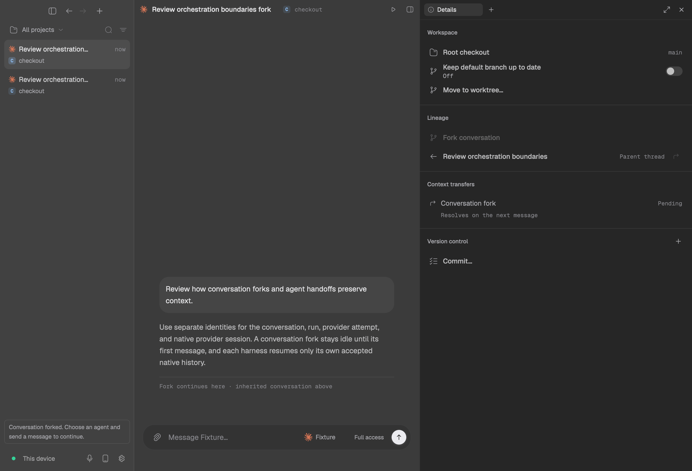
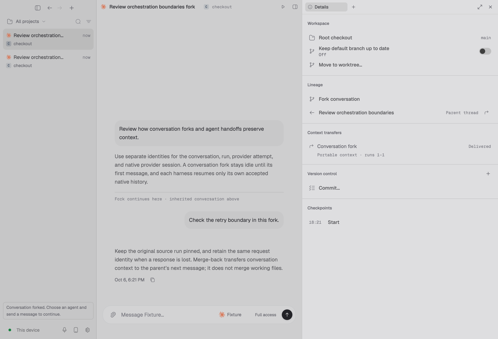
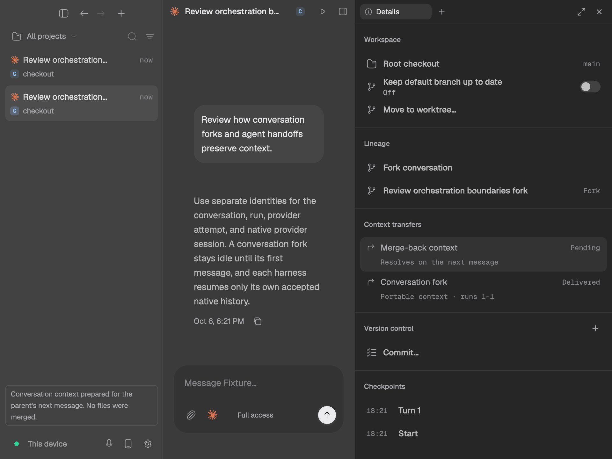

# T3 orchestration parity audit — 2026-10-06

Reference: [pingdotgg/t3code at fbe5df2d](https://github.com/pingdotgg/t3code/tree/fbe5df2d4b630d13adc8fe2d38cab354e6d66d67).
Noches baseline: `dev` at `d0e08ba2`. This is an original Rust/GPUI adaptation,
not a replacement of Noches with T3's TypeScript/Electron stack.

Freshness check: fetched T3 `main` at
[`f4f148eb`](https://github.com/pingdotgg/t3code/tree/f4f148eb670622a049ae6561d7795011e383fc43).
The compared orchestration-v2 implementation, relationship controls and
client-runtime state are unchanged from the pinned reference. The comparison
found only unrelated test edits in those areas.

T3's refinement comes from separating the app conversation, logical run,
provider attempt, native provider conversation, child task, completion mail,
context transfer and file checkpoint. Correctness depends on their ownership
and acceptance boundaries, not on a visually similar Agents panel. Noches
already implements most of this graph; the changes here repair handoff
continuity and expose the missing user-facing transfer workflow.

## Full-stack map

The source links below are pinned implementation references. Upstream
`docs/orchestration-v2/feature-lifecycles.md` also describes target behavior;
it is not alone evidence that a feature works in either application.

| Boundary | T3 implementation | Noches implementation / finding |
| --- | --- | --- |
| Persistent authority | `EventStore`, `ProjectionStore`, `Orchestrator`, `EffectOutbox` | `orchestration/{store,command,projection,effects,outbox}`: transactional receipts, durable effects, owner/epoch fencing; existing. |
| Ordinary thread integration | `ThreadMessageIntake`, `RunExecutionService`, `ProviderEventIngestor` | `thread_service`, `threads/planner`, `sessions`, `runner`: legacy adoption, one logical run, no second provider start; existing and regression-tested. |
| Exact provider/model selection | `ProviderAdapterRegistry`, `ProviderSelectionTransition` | `provider_instances` catalog shared by composer, MCP and runner; custom IDs/options remain exact. Existing. |
| Return to a harness | [ProviderTurnStartService](https://github.com/pingdotgg/t3code/blob/fbe5df2d4b630d13adc8fe2d38cab354e6d66d67/apps/server/src/orchestration-v2/ProviderTurnStartService.ts), `ProviderSwitchService` | **Fixed:** independent native handles per instance/generation; A→B→A resumes A, bridges B's delta, or reconstructs fully when unsafe. Prior code overwrote one app-wide handle and cleared resume even for a delta. |
| Portable context | [ContextHandoffService](https://github.com/pingdotgg/t3code/blob/fbe5df2d4b630d13adc8fe2d38cab354e6d66d67/apps/server/src/orchestration-v2/ContextHandoffService.ts), `ContextHandoffBudget`, `ContextHandoffDelivery` | `transfer/{context,delivery}`: bounded whole-item selection, occupancy/input/attachment budget, coverage and uncertain-delivery receipts. **Fixed:** imported runless history, checkout/native identity fences, restart metadata recovery. |
| Delegation and handoff | `DelegatedTaskService`, `NotificationMailbox`, `RunFinalizationService` | `task`, `mailbox`, `runner`, scoped MCP: task ID distinct from backing thread, nested children, cancellation, steering/queued completion and explicit acknowledgement. Existing. |
| Native vs app-owned agents | `SubagentProjection`, provider event ingest, client-runtime subagent selectors | `delegation`, `subagents`, `agents`, composer/sidebar: observational native children and app-owned tasks retain separate authority and share presentation. Existing. |
| Thread launch/workspace binding | `ThreadLaunchService`, `ThreadManagementService` | `launch`, `worktree`, `thread_service`: explicit root/existing/new-worktree preparation, durable setup admission; existing with adapter gaps below. |
| Lazy fork and merge-back | [ThreadForkService](https://github.com/pingdotgg/t3code/blob/fbe5df2d4b630d13adc8fe2d38cab354e6d66d67/apps/server/src/orchestration-v2/ThreadForkService.ts) | **Added:** owner-routed user RPCs, pinned source, stable request identity, immediate inherited chat config, no eager provider start. Direct-parent merge prepares context; it is not a Git merge. |
| Thread relationships | [ThreadRelationshipsControl](https://github.com/pingdotgg/t3code/blob/fbe5df2d4b630d13adc8fe2d38cab354e6d66d67/apps/web/src/components/chat/ThreadRelationshipsControl.tsx) | **Added:** Details lineage, parent/fork navigation, bounded scroll regions, fork/checkpoint actions, merge-back action and sidebar fork shortcut. Existing Agents panel continues to own delegated-task controls. |
| Inherited transcript | `threadHistoryPaging`, client-runtime conversation projection | **Added:** frozen text preview in the child transcript with unique source-qualified IDs and explicit boundary. No document duplication or historical live controls. Full inherited tool/media projection is still a gap. |
| Delivery visibility | V2 context transfers/handoffs and provider acceptance | **Added:** strategy, provider IDs, run coverage, omitted-item counts and Pending/Ready/Prepared/Delivered/Failed/Superseded statuses. Both source and target can see the redacted target acceptance receipt. Consumption alone is never displayed as delivery. |
| Queue, steering, questions | queued-run ordering, `ProviderTurnControlService`, `RuntimeRequestService` | `queue`, existing composer queue/input panels and run-attempt fencing. **Fixed:** queued delivery atomically rebinds the existing run/attempt/root to the selected provider generation; transfer preparation uses the exact admitted run, never `.runs.last()`. SQL-only queue desktop management remains a gap. |
| Scheduler | server scheduler and launch/intake dispatch | `scheduler`, Settings Automations: persistent claims, recurring/manual/webhook work, bound/unbound dispatch, restart/deduplication. Existing. |
| PR association and settlement | `PullRequestWatchReactor`, `PullRequestSyncReactor`, `ThreadSettlementService` | `pull_requests`, `git_actions`, Details/lifecycle: authenticated linking, stable watch receipts, wake/settlement fences. Some environment/project settlement policy UI remains incomplete. |
| Checkpoints | `CheckpointService`, `CheckpointRollbackService` | files-only checkpoint preview/checksum/HEAD/ownership/backup safety. No conversation rewind; sparse/submodule support is explicitly refused. |
| Remote devices/security | environment routing, scoped orchestrator MCP | owner-routed RPC, private MCP credentials, replicated Loro projections and barriers. Transport intentionally differs; replicas never execute provider effects. New transfer writes use user authority, not fabricated agent credentials. |
| Recovery/publication | effect reconciliation, projection recovery, thread streams | durable kernel recovery, publication outbox and ordinary chat/document discovery. **Fixed:** publishing a new fork no longer drops its inherited composer config. |

## End-to-end ownership

```text
User input / queued input / scheduler / delegated completion
  → owning-host intake and policy checks
  → one canonical logical run, active attempt and root node
  → exact catalog provider/model/options
  → that provider's native conversation OR bounded context reconstruction
  → harness execution and acceptance
  → fenced provider events, durable transfer receipts and completion mail
  → persistent projection/publication
  → native thread, composer, Agents and Details surfaces
```

An app thread is never itself the native provider conversation. The important
continuity regression is:

```text
A / native-a → B / native-b + full A context → A / native-a + missed B delta
```

The last step is allowed only with accepted native coverage and compatible
model/options/checkout. Otherwise A gets a fresh generation and full portable
context. A queued message must retain its original logical run identity while
all execution bindings move together; preparing another queued run's history
is not an acceptable substitute.

## Interaction and safety decisions

- Honor Noches' `docs/design/control-plane.md`: native flush GPUI panes, neutral
  theme surfaces, monospace metadata and meaningful state color. T3 interaction
  semantics do not authorize reintroducing mascots or replacing this design.
- Fork a finished source without running an agent. Choose another harness on
  the idle child if desired; native compatibility is decided at first send.
- Pin the source before dispatch. Later parent runs cannot leak into a fork.
  Retry the exact request after an uncertain response; do not mint another
  child or retarget a previously accepted command.
- Merge-back retains the recorded fork base, supersedes the same fork's older
  pending transfer, and preserves queued/multiple-fork refusals. Acceptance
  never edits Git or starts/interrupts the parent.
- Inherited previews are prepared off the UI thread and bounded to the latest
  100 text messages/10,000 Unicode scalars each. Omission and shortening are
  explicit. Full source history remains in the parent. Private reasoning,
  approvals, tool calls and transport attachment fetches are not replayed.

## Remaining gaps — not claimed 1:1

1. Native Claude/Pi/negotiated ACP fork and loaded-process history injection;
   Codex legacy paginated fork/revert fallback. Adapter capability flags remain
   conservative; portable fallback is functional, not equivalent native state.
2. Full inherited tool/media history, complete lineage graph/hover interactions,
   keyboard parity and user-controlled provider-session disconnect/reconstruction.
3. Canonical SQL-only MCP/scheduler queue management in the desktop queue tray;
   queued merge-back consumption remains explicitly unsupported.
4. Live catalog context-window lookup, cross-account native continuation,
   `/compact` handoff deferral, conversation rollback and driver-authorized
   cross-checkout native continuation.
5. Provider clone/setup progress edges, project/environment PR-settlement
   settings, sparse/submodule checkpoints and some cleanup/recovery policy.
6. Live installed-provider, remote multi-device, Windows, Linux and iOS
   verification must not be inferred from local Mac/mock tests.

## Verification

The task uses an isolated worktree and build target; the other performance
worktree and the main checkout's untracked files are untouched. Serial tests
avoid pre-existing timing-sensitive checkpoint/worker interactions.

A read-only `git merge-tree` comparison with performance PR #46 at
`18d66d3af0af7b0e33f2eae284cd5b5e880af787` reports no textual conflicts.
Neither that PR's commits nor its worktree are changed or included here.
Combined performance-plus-parity runtime behavior has not been tested.

| Final local check | Result |
| --- | --- |
| Engine library | 631 passed, 0 failed, 2 ignored |
| Selected engine integration suites | 46 passed, 0 failed, 1 ignored |
| Desktop library, including pane/sidebar regressions | 1,501 passed, 0 failed, 1 ignored |
| Doc/proto/RPC libraries and integration suites | 240 passed, 0 failed, 2 ignored |
| Production `zeron` desktop build (`--locked`) | Passed |
| Native orchestration fixture, dark and light launches | Passed; 1320×900 and 960×720 layouts inspected |
| `git diff --check` | Passed |

The selected engine integrations are `thread_transfers_rpc`,
`orchestration_bootstrap`, `orchestration_mcp`, `registry_adoption`,
`restart_resume`, `message_queue`, `queue_lifecycle_rpc` and
`scheduler_bootstrap`. Focused transfer coverage is included in the engine
library count, not counted a second time.

- A→B→A with/without restart, changed model/options/checkout, legacy history,
  accepted-current-run replay and native delivery receipt cases pass.
- All 25 message-queue tests pass, including shared native session with
  coherent run/attempt/root binding and changed-selection reconstruction.
- Production `thread_transfers_rpc`: 3 passing tests. Real host assembly,
  source→idle fork→child first input→merge-back→parent next input; inherited
  config, pinned source, user provenance, unchanged working files,
  after-commit response loss, replay/rebuild, identity collision, foreign
  owner and wrong-project/non-parent refusal.
- The native fixture invokes the production Shell actions and real transfer
  RPCs against an isolated engine/checkout. It asserts an idle child, parent
  lineage, first child completion, parent-visible Delivered receipt, Pending
  merge-back, no eager parent run and unchanged working files. Successful
  transfer feedback is neutral; failure feedback retains the danger palette.

Reproduce from this checkout with Cargo available on `PATH`:

```sh
cargo test -p zeron-engine --lib \
  --test thread_transfers_rpc --test orchestration_bootstrap \
  --test orchestration_mcp --test registry_adoption --test restart_resume \
  --test message_queue --test queue_lifecycle_rpc --test scheduler_bootstrap \
  --locked -- --test-threads=1
cargo test -p zeron-ui --lib --locked -- --test-threads=1
cargo test -p zeron-proto -p zeron-rpc -p zeron-doc --locked
cargo build -p zeron --locked
```

Native Mac render reproduction (mock provider only):

```sh
fixture_output="$(mktemp -d /tmp/noches-orchestration-qa.XXXXXX)"
cargo run -p zeron-ui --example orchestration-fixture \
  --features orchestration-fixture --locked -- "$fixture_output" dark
cargo run -p zeron-ui --example orchestration-fixture \
  --features orchestration-fixture --locked -- "$fixture_output" light
```

The fixture writes per-mode PASS files and PNGs; it does not inject global
keyboard/mouse events or invoke installed agents. Separate launches initialize
the appearance before opening the window. Exploratory in-process theme
switching exposed `RefCell already borrowed` in the unchanged GPUI macOS
`on_appearance_changed` callback (`window.rs:1650`) during synchronous
`NSApplication.setAppearance`; that theme-transition warning is not fixed by
this PR. The final separate-mode transfer runs emit no such error. A readiness
probe also emits an incomplete WebSocket-handshake warning before successful
IPC attachment. Existing compiler/Objective-C/linker warnings remain.

Ignored live-provider/edge/tailnet/private-snapshot tests are not passes.
Current installed-provider, remote-device and non-Mac verification has not
been performed. No release or integration-branch mutation is part of this task.

### Native rendering evidence

Idle fork: inherited text, visible boundary, parent navigation and neutral
success feedback; no provider has started.



Continued fork in light appearance: inherited text remains separate from the
child's own input, and the portable-context receipt reads Delivered.



Parent after merge-back at 960 pixels: fork delivery remains visible, merge
context is Pending, and the message explicitly states that no files were merged.


