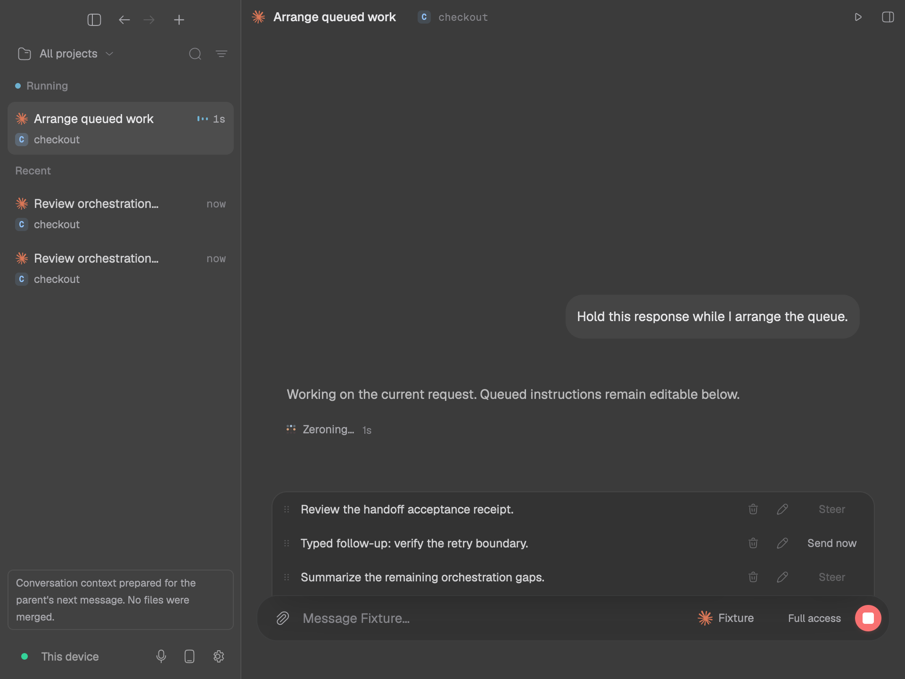
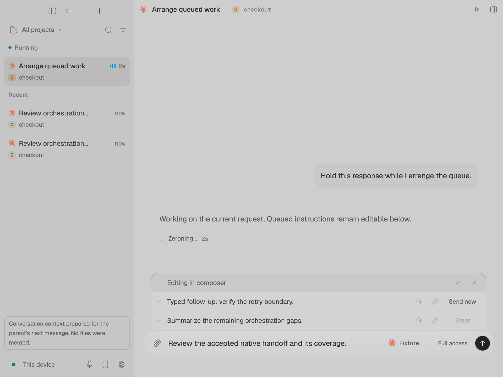
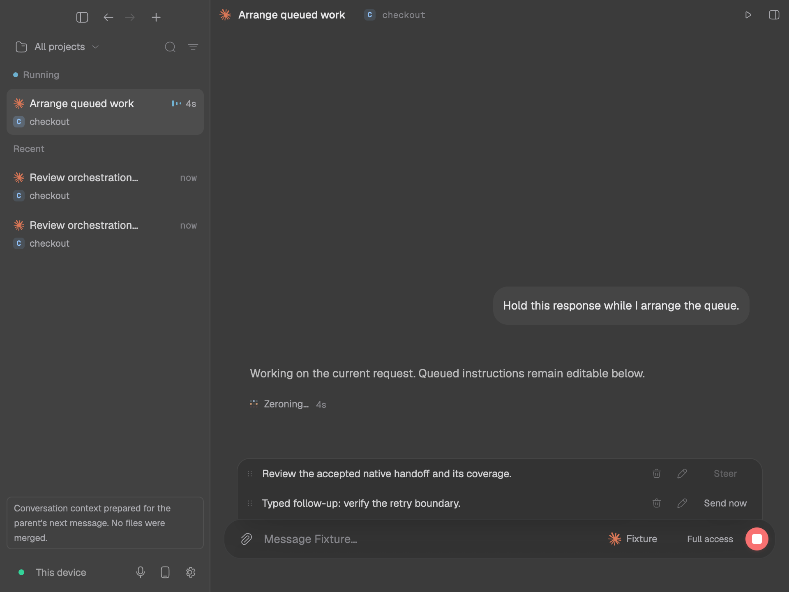
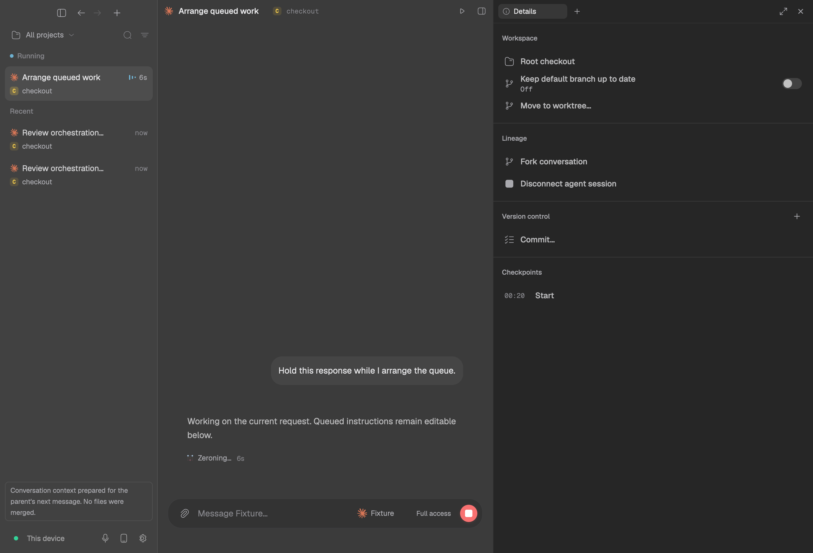
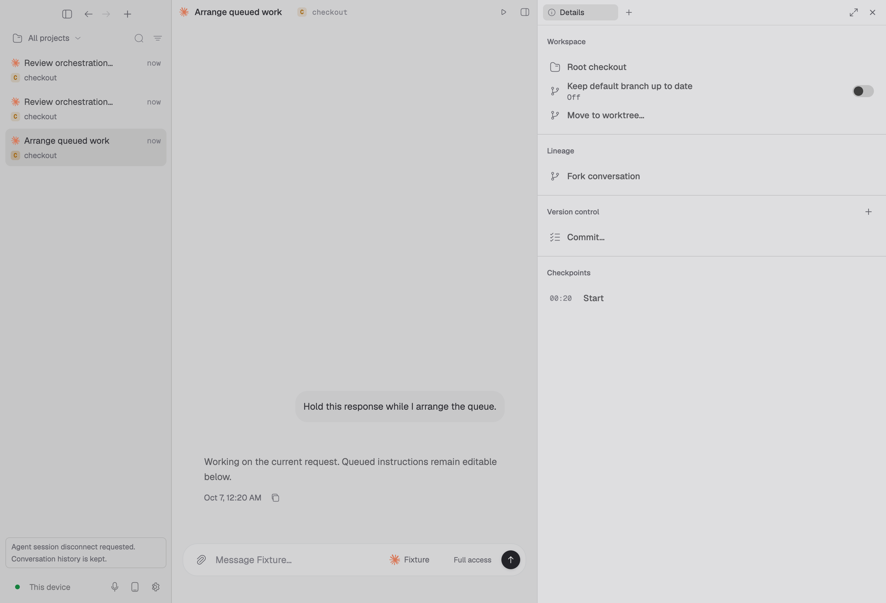

# T3 orchestration parity audit — 2026-10-06

Reference: [pingdotgg/t3code at fbe5df2d](https://github.com/pingdotgg/t3code/tree/fbe5df2d4b630d13adc8fe2d38cab354e6d66d67).
Noches baseline: `dev` at `d0e08ba2`. This is an original Rust/GPUI adaptation,
not a replacement of Noches with T3's TypeScript/Electron stack.

Latest freshness check: compared T3 `main` at
[`d021f57b`](https://github.com/pingdotgg/t3code/tree/d021f57bf3a500e419e800c3eb957568bed8f713)
with the pinned reference. `ProviderTurnStartService`, `ContextHandoffDelivery`
and the fork/transfer services are unchanged. The newer adapter/session-manager
interruption cleanup, per-turn busy identity and app-owned subagent Stop control
were inspected; equivalent full current-upstream parity is not claimed.
The earlier comparison at `8ddf200e` predated those changes.

T3's refinement comes from separating the app conversation, logical run,
provider attempt, native provider conversation, child task, completion mail,
context transfer and file checkpoint. Correctness depends on their ownership
and acceptance boundaries, not on a visually similar Agents panel. Noches
already implements most of this graph; the changes here repair handoff
continuity and expose the missing user-facing transfer workflow.

## Full-stack map

The source links below are pinned implementation references. Upstream
`docs/orchestration-v2/feature-lifecycles.md` also describes target behavior;
it is not alone evidence that a feature works in either application.

| Boundary | T3 implementation | Noches implementation / finding |
| --- | --- | --- |
| Persistent authority | `EventStore`, `ProjectionStore`, `Orchestrator`, `EffectOutbox` | `orchestration/{store,command,projection,effects,outbox}`: transactional receipts, durable effects, owner/epoch fencing; existing. |
| Ordinary thread integration | `ThreadMessageIntake`, `RunExecutionService`, `ProviderEventIngestor` | `thread_service`, `threads/planner`, `sessions`, `runner`: legacy adoption, one logical run, no second provider start; existing and regression-tested. |
| Exact provider/model selection | `ProviderAdapterRegistry`, `ProviderSelectionTransition` | `provider_instances` catalog shared by composer, MCP and runner; custom IDs/options remain exact. Existing. |
| Return to a harness | [ProviderTurnStartService](https://github.com/pingdotgg/t3code/blob/fbe5df2d4b630d13adc8fe2d38cab354e6d66d67/apps/server/src/orchestration-v2/ProviderTurnStartService.ts), `ProviderSwitchService` | **Fixed:** independent native handles per instance/generation; A→B→A resumes A, bridges B's delta, or reconstructs fully when unsafe. Prior code overwrote one app-wide handle and cleared resume even for a delta. |
| Prompt acceptance and retry | `ProviderTurnStartService` missed-attempt history, `ContextHandoffDelivery` acceptance callback | **Fixed:** session readiness and local steering are not accepted input. Codex RPC/OpenCode POST acknowledgements or actual native response bind the exact root attempt; failed/interrupted untold inputs become bounded, restart-durable retry context. Settled deliveries and deliberate budget omissions are not repeatedly injected. |
| Portable context | [ContextHandoffService](https://github.com/pingdotgg/t3code/blob/fbe5df2d4b630d13adc8fe2d38cab354e6d66d67/apps/server/src/orchestration-v2/ContextHandoffService.ts), `ContextHandoffBudget`, `ContextHandoffDelivery` | `transfer/{context,delivery}`: bounded whole-item selection, occupancy/input/attachment budget, coverage and uncertain-delivery receipts. **Fixed:** imported runless history, checkout/native identity fences, restart metadata recovery. |
| Delegation and handoff | `DelegatedTaskService`, `NotificationMailbox`, `RunFinalizationService` | `task`, `mailbox`, `runner`, scoped MCP: task ID distinct from backing thread, nested children, cancellation, steering/queued completion and explicit acknowledgement. Existing. |
| Native vs app-owned agents | `SubagentProjection`, provider event ingest, client-runtime subagent selectors | `delegation`, `subagents`, `agents`, composer/sidebar: observational native children and app-owned tasks retain separate authority and share presentation. Existing. |
| Thread launch/workspace binding | `ThreadLaunchService`, `ThreadManagementService` | `launch`, `worktree`, `thread_service`: explicit root/existing/new-worktree preparation, durable setup admission; existing with adapter gaps below. |
| Lazy fork and merge-back | [ThreadForkService](https://github.com/pingdotgg/t3code/blob/fbe5df2d4b630d13adc8fe2d38cab354e6d66d67/apps/server/src/orchestration-v2/ThreadForkService.ts) | **Added:** owner-routed user RPCs, pinned source, stable request identity, immediate inherited chat config, no eager provider start. Direct-parent merge prepares context; it is not a Git merge. |
| Thread relationships | [ThreadRelationshipsControl](https://github.com/pingdotgg/t3code/blob/fbe5df2d4b630d13adc8fe2d38cab354e6d66d67/apps/web/src/components/chat/ThreadRelationshipsControl.tsx) | **Added:** Details lineage, parent/fork navigation, bounded scroll regions, fork/checkpoint actions, merge-back action and sidebar fork shortcut. Existing Agents panel continues to own delegated-task controls. |
| Disconnect agent session | `ThreadRelationshipsControl.stopSession`, client-runtime `stopThreadSession`, `Orchestrator.dispatchProviderSessionDetach`, `ProviderSessionManager` | **Added:** passive attachment revisions, owner-routed user RPC, atomic detach plan and durable exact-run teardown. Conversation/native history and app-owned child threads are preserved. Reattachment, changed attempts/generations and active or idle replacement runtimes fence delayed effects. |
| Inherited transcript | `threadHistoryPaging`, client-runtime conversation projection | **Added:** frozen text preview in the child transcript with unique source-qualified IDs and explicit boundary. No document duplication or historical live controls. Full inherited tool/media projection is still a gap. |
| Delivery visibility | V2 context transfers/handoffs and provider acceptance | **Added:** strategy, provider IDs, run coverage, omitted-item counts and Pending/Ready/Prepared/Delivered/Failed/Superseded statuses. Both source and target can see the redacted target acceptance receipt. Consumption alone is never displayed as delivery. |
| Queue, steering, questions | [threadWorkflows](https://github.com/pingdotgg/t3code/blob/fbe5df2d4b630d13adc8fe2d38cab354e6d66d67/packages/client-runtime/src/state/threadWorkflows.ts), [QueuedRunsControl](https://github.com/pingdotgg/t3code/blob/fbe5df2d4b630d13adc8fe2d38cab354e6d66d67/apps/web/src/components/chat/QueuedRunsControl.tsx), `ProviderTurnControlService`, `RuntimeRequestService` | **Added:** one native tray for typed intents and SQL-only agent/automation work, with composer text edit, cancellation, mixed reordering and capability-fenced active steering. Automatic completions/notifications stay out of the user tray. **Fixed:** coherent queued run/attempt/root rebinding and exact admitted-run transfer preparation. Interrupt/restart promotion and queued merge-back remain gaps. |
| Scheduler | server scheduler and launch/intake dispatch | `scheduler`, Settings Automations: persistent claims, recurring/manual/webhook work, bound/unbound dispatch, restart/deduplication. Existing. |
| PR association and settlement | `PullRequestWatchReactor`, `PullRequestSyncReactor`, `ThreadSettlementService` | `pull_requests`, `git_actions`, Details/lifecycle: authenticated linking, stable watch receipts, wake/settlement fences. Some environment/project settlement policy UI remains incomplete. |
| Checkpoints | `CheckpointService`, `CheckpointRollbackService` | files-only checkpoint preview/checksum/HEAD/ownership/backup safety. No conversation rewind; sparse/submodule support is explicitly refused. |
| Remote devices/security | environment routing, scoped orchestrator MCP | owner-routed RPC, private MCP credentials, replicated Loro projections and barriers. Transport intentionally differs; replicas never execute provider effects. New transfer writes use user authority, not fabricated agent credentials. |
| Recovery/publication | effect reconciliation, projection recovery, thread streams | durable kernel recovery, publication outbox and ordinary chat/document discovery. **Fixed:** publishing a new fork no longer drops its inherited composer config. |

## End-to-end ownership

```text
User input / queued input / scheduler / delegated completion
  → owning-host intake and policy checks
  → one canonical logical run, active attempt and root node
  → exact catalog provider/model/options
  → that provider's native conversation OR bounded context reconstruction
  → harness execution and acceptance
  → fenced provider events, durable transfer receipts and completion mail
  → persistent projection/publication
  → native thread, composer, Agents and Details surfaces
```

An app thread is never itself the native provider conversation. The important
continuity regression is:

```text
A / native-a → B / native-b + full A context → A / native-a + missed B delta
```

The last step is allowed only with accepted native coverage and compatible
model/options/checkout. Otherwise A gets a fresh generation and full portable
context. A queued message must retain its original logical run identity while
all execution bindings move together; preparing another queued run's history
is not an acceptable substitute.

## Interaction and safety decisions

- Honor Noches' `docs/design/control-plane.md`: native flush GPUI panes, neutral
  theme surfaces, monospace metadata and meaningful state color. T3 interaction
  semantics do not authorize reintroducing mascots or replacing this design.
- Fork a finished source without running an agent. Choose another harness on
  the idle child if desired; native compatibility is decided at first send.
- Pin the source before dispatch. Later parent runs cannot leak into a fork.
  Retry the exact request after an uncertain response; do not mint another
  child or retarget a previously accepted command.
- Merge-back retains the recorded fork base, supersedes the same fork's older
  pending transfer, and preserves queued/multiple-fork refusals. Acceptance
  never edits Git or starts/interrupts the parent.
- Inherited previews are prepared off the UI thread and bounded to the latest
  100 text messages/10,000 Unicode scalars each. Omission and shortening are
  explicit. Full source history remains in the parent. Private reasoning,
  approvals, tool calls and transport attachment fetches are not replayed.
- Queue snapshots are additive and capability/version gated. A bounded document
  accessor expands only `uiState.queueState`, not the full transcript/tool
  projection. Unrelated SQL sequence changes do not wake the queue renderer.
  Existing queue subscriptions, edit leases and split-pane routing are retained.
- Canonical rows are presentation-only, never synthetic Loro intents. A delayed
  document-backed projection cannot resurrect a consumed typed row. Automatic
  completion and notification rows are excluded, matching T3's user-queue selector.
- Canonical actions use the owning host's user authority and the existing kernel
  planner. Stable request reservations prevent a retry from changing its content
  or target. SQL-only text edits preserve attachments, context and provenance;
  stale text or an already-started run is refused without overwriting it. An
  automatic drain retains both the edit and the composer's previous draft.
- Typed rows retain explicit interrupting **Send now** and their host edit leases.
  SQL-only rows advertise **Steer** only when the running provider attempt/turn
  supports active steering. A passive UI hint and the actual mutation share the
  same steering fences; delayed effects cannot become a late send or restart.
- Disconnect is distinct from archive, conversation reset and ordinary turn
  interruption. It uses the exact observed attachment set and attachment-local
  revisions, not changing token usage or a guessed provider generation. Stable
  request reservations preserve the target across response loss and projection
  rebuild. The worker additionally checks canonical attempt/provider identity
  and a private runtime run tag, independent of agent credential expiry, before
  signaling the exact handle under its map lock. Neutral feedback says
  **requested**, not that an asynchronous teardown has already finished.
- A native session ID proves attachment, not input acceptance. `SessionStarted`,
  local `Steered`, context telemetry and thread-only references cannot settle
  handoff receipts. Host-only `InputAccepted` is emitted after successful Codex
  turn-start/steer RPCs or the matching OpenCode prompt response, never on enqueue.
  OpenCode responses carry unique submission identities; a late ACK/failure
  from a finished input cannot bind or fail its successor.
- Inline context receipts retain the actual bounded selected/omitted IDs and
  prepared run/attempt/root/provider-thread fence in private SQLite state.
  Acceptance settles only that exact preparation/native identity inside the
  provider-event transaction. A repeated refused preparation preserves the
  original pending ACK fence. Session readiness cannot manufacture delivery.
- Retry context recovers earlier failed/interrupted untold root inputs on the
  same provider thread. Its stable saved snapshot survives process restart and
  projection rebuild; fork/switch context and accepted native coverage suppress
  duplicate items. Historical attachments/private reasoning/native tools are
  not re-executed. A successfully accepted failed turn is not replayed.
- First-response acceptance and assistant/error materialization share a planned
  item-ordinal allocator. Newly emitted items in the same transaction contribute
  to the next ordinal, preserving user-before-assistant pagination and preventing
  premature acknowledgement of a partial child result.
- Queue repair acknowledges a saved command-generation watermark rather than
  requiring the entire live document to stay clean. Concurrent later transcript
  changes remain independently dirty; a real failed snapshot write still leaves
  the repair outbox unacknowledged. This fixes an RPC failure despite the queue
  patch already being durably saved, without serializing away concurrent tests.

## Remaining gaps — not claimed 1:1

1. Native Claude/Pi/negotiated ACP fork and loaded-process history injection;
   Codex legacy paginated fork/revert fallback. Adapter capability flags remain
   conservative; portable fallback is functional, not equivalent native state.
2. Full inherited tool/media history, complete lineage graph/hover interactions,
   keyboard parity and user-controlled forced session reconstruction. Provider
   session disconnect is implemented; it preserves rather than resets history.
3. Canonical queue edits are text-only (existing attachment metadata is shown and
   preserved, not replaced). Native active-steering promotion is implemented;
   interrupt/restart promotion and queued merge-back consumption remain unsupported.
   The legacy active-steer ledger still retires at a local transcript boundary;
   per-steered-input native acknowledgement/rejection recovery is a separate gap
   from the verified root-turn acceptance and missed-start recovery here.
4. Live catalog context-window lookup, cross-account native continuation,
   `/compact` handoff deferral, conversation rollback and driver-authorized
   cross-checkout native continuation.
5. Provider clone/setup progress edges, project/environment PR-settlement
   settings, sparse/submodule checkpoints and some cleanup/recovery policy.
6. Live installed-provider, remote multi-device, Windows, Linux and iOS
   runtime/visual verification must not be inferred from local Mac/mock tests
   or from platform unit/integration CI.
7. Older builds stored false acceptance at session initialization. Existing
   provider-turn/delivery rows cannot retrospectively prove provider submission;
   no speculative migration or historical duplicate replay is performed.
8. The latest upstream interruption/attachment cleanup and relationship-panel
   app-owned subagent Stop interaction require further parity verification.

## Verification

The task uses an isolated worktree and build target; the other performance
worktree and the main checkout's untracked files are untouched. Final full
library/integration checks use serial execution where noted below; queue
repeats and the broader session-sync gate also pass with default parallelism.

A read-only `git merge-tree` comparison of the disconnect implementation and
instruction EOL rule at `4cc81afe` with performance PR #46 at
`89f648f60f20160152214645df96ea495b00fc3d` reports no textual conflicts.
PR #46 subsequently merged into `dev` at `6dc76ff4`. Neither its commits nor
its worktree are changed or copied into this feature branch.
CI tested the previously published parity implementation combined with PR #46
through PR merge ref `8f627e2c`. That is not live-provider proof or verification
of this later acceptance/retry follow-up combined with the performance changes.

| Final local check | Result |
| --- | --- |
| Engine library | 643 passed, 0 failed, 2 ignored |
| Selected engine integration suites | 57 passed, 0 failed, 1 ignored |
| Desktop library, including pane/sidebar regressions | 1,506 passed, 0 failed, 1 ignored |
| Doc/proto/RPC libraries and integration suites | 244 passed, 0 failed, 2 ignored |
| Full harness library, integrations and doctest | 433 passed, 0 failed, 12 ignored |
| Production `zeron` desktop build (`--locked`) | Passed |
| Native orchestration fixture, dark and light launches | Passed; 1320×900 and 960×720 layouts inspected |
| Broader session-sync gate (`scripts/ci/run-session-sync.py`) | Passed; all 14 selected targets plus doctests, stable source |
| `git diff --check` | Passed |

The selected engine integrations are `thread_transfers_rpc`,
`orchestration_bootstrap`, `orchestration_mcp`, `registry_adoption`,
`restart_resume`, `message_queue`, `queue_lifecycle_rpc` and
`scheduler_bootstrap` and `codex_subagents`. These checks total 2,883 distinct
passing tests. Focused transfer coverage is included in the engine library
count, not counted a second time. The session-sync gate supplies additional
coverage; its overlapping engine/restart/child tests are not added to this total.

- A→B→A with/without restart, changed model/options/checkout, legacy history,
  accepted-current-run replay and native delivery receipt cases pass.
- All 31 message-queue tests pass, including shared native session with
  coherent run/attempt/root binding and changed-selection reconstruction.
- Production disconnect tests cover active teardown, preserved native history
  on the next input, no dependency on an unexpired agent MCP credential, stable
  response-loss retries, request collisions, foreign ownership and delayed
  effects after projection rebuild. A truly parked mock adapter proves that
  an idle replacement, not just an active replacement, survives an old effect.
- New production queue RPC tests cover live SQL-only snapshots without polling,
  unchanged legacy watch contracts, stable edit/cancel/promotion replay, request
  identity collision, stale edits, attachment/provenance preservation, foreign
  owner refusal, mixed Loro/SQL ordering, protected edit leases and successful
  exact-attempt steering without a second provider start.
- UI regressions cover thread-scoped monotonic snapshots, automatic-row exclusion,
  mixed deduplication, consumed-intent non-resurrection, legacy-host fallback and
  recovery of both drafts when automatic drain wins an open canonical edit.
  Queue Edit buttons share the composer's admission predicate and stay disabled
  while another edit is acquiring, open or finishing.
- Resumed Codex child fixtures use the root conversation accepted before
  restart, rather than substituting a different fixture-only native handle.
  Both child-document/chip persistence regressions and all 26 offline Codex
  protocol tests pass; production identity fences are not weakened.
- Production `thread_transfers_rpc`: 6 passing tests. Real host assembly,
  source→idle fork→child first input→merge-back→parent next input; inherited
  config, pinned source, user provenance, unchanged working files,
  after-commit response loss, replay/rebuild, identity collision, foreign
  owner and wrong-project/non-parent refusal; real Codex/OpenCode rejection,
  untold-input recovery, native acceptance and transcript-ordering regressions.
- The native fixture invokes the production Shell actions and real transfer
  RPCs against an isolated engine/checkout. It asserts an idle child, parent
  lineage, first child completion, parent-visible Delivered receipt, Pending
  merge-back, no eager parent run and unchanged working files. Successful
  transfer feedback is neutral; failure feedback retains the danger palette.
- The extended native fixture runs a held mock provider, subscribes to the
  production session-status stream, and receives a real mixed queue. Production
  composer/Shell handlers edit SQL-only work, reorder it around a typed intent
  and cancel it. Assertions verify that only the typed row exists in Loro.
  The disconnect action then uses the production Shell/RPC path and waits for
  actual runtime disappearance, attachment removal and cleared UI retry/busy
  state while the transcript remains visible.

Reproduce from this checkout with Cargo available on `PATH`:

```sh
cargo test -p zeron-engine --lib \
  --test thread_transfers_rpc --test orchestration_bootstrap \
  --test orchestration_mcp --test registry_adoption --test restart_resume \
  --test message_queue --test queue_lifecycle_rpc --test scheduler_bootstrap \
  --test codex_subagents \
  --locked -- --test-threads=1
cargo test -p zeron-ui --lib --locked -- --test-threads=1
cargo test -p zeron-proto -p zeron-rpc -p zeron-doc --locked
cargo test -p zeron-harness --locked -- --test-threads=1
cargo test -p zeron-engine --test message_queue --locked
python3 scripts/ci/run-session-sync.py
cargo build -p zeron --locked
```

Native Mac render reproduction (mock provider only):

```sh
fixture_output="$(mktemp -d /tmp/noches-orchestration-qa.XXXXXX)"
cargo run -p zeron-ui --example orchestration-fixture \
  --features orchestration-fixture --locked -- "$fixture_output" dark
cargo run -p zeron-ui --example orchestration-fixture \
  --features orchestration-fixture --locked -- "$fixture_output" light
```

The fixture writes per-mode PASS files and PNGs; it does not inject global
keyboard/mouse events or invoke installed agents. Separate launches initialize
the appearance before opening the window. Exploratory in-process theme
switching exposed `RefCell already borrowed` in the unchanged GPUI macOS
`on_appearance_changed` callback (`window.rs:1650`) during synchronous
`NSApplication.setAppearance`; that theme-transition warning is not fixed by
this PR. The final separate-mode transfer runs emit no such error. A readiness
probe also emits an incomplete WebSocket-handshake warning before successful
IPC attachment. Existing compiler/Objective-C/linker warnings remain.

Ignored live-provider/edge/tailnet/private-snapshot tests are not passes.
Current installed-provider, remote-device and non-Mac verification has not
been performed. No release or integration-branch mutation is part of this task.

CI on published revision `1eeebb14` completed: the executed Mac/UI/browser,
Windows UI/harness/engine/packaging, session-sync, networking and policy jobs
passed. Windows engine ran 637 library and 22 integration tests with no failures
against PR merge ref `8f627e2c9978dece17767df2217465bd23e41b56`, combining the
published source with performance PR #46. Windows native GUI and iOS jobs were
skipped, not passes.

The [Linux Cursor compatibility job](https://github.com/KldsSeeGhosts/noches/actions/runs/37550486502/job/112564548461)
failed `desktop_mixed_queue_reorder_preserves_intents_and_edit_leases` (30 queue
tests passed, one failed). A default-parallel local run also reproduced the
same generic RPC error during queue promotion. A deterministic snapshot hook
then proved that the queue patch was saved but a later transcript change made
the whole-document cleanliness check fail. The command-generation watermark
fix passes that regression and a real SQLite write-failure guard. Four
consecutive default-parallel local queue runs now pass all 31 tests. New-head
Linux CI remains required; the older job is not claimed green.

The byte-pinned MCP instruction fixture retains its narrowly scoped LF checkout
rule; the SHA/length tests are unchanged. These CI results do not prove a later
revision's CI or installed-provider/native-GUI behavior.
An isolated checkout-index probe with `core.autocrlf=true` retains the exact
pinned instruction SHA on this Mac; it is not a Windows runtime test.

### Native rendering evidence

Idle fork: inherited text, visible boundary, parent navigation and neutral
success feedback; no provider has started.


Continued fork in light appearance: inherited text remains separate from the
child's own input, and the portable-context receipt reads Delivered.


Parent after merge-back at 960 pixels: fork delivery remains visible, merge
context is Pending, and the message explicitly states that no files were merged.


Unified queue with a live running-status subscription: SQL-only agent work and
automation work surround a typed follow-up. Unsupported active steering stays
disabled; typed **Send now** remains explicitly interrupting.



The SQL-only row reserves its visible editing slot while its text is in the
composer. Save/cancel controls and the typed queue remain available.



After save, reorder and cancellation, the remaining canonical row shows the
accepted edit, and the typed row is still the only Loro intent. The provider
remains on its original running attempt.



The live attached session exposes a quiet Details action. Disconnect is not
archive, fork, merge-back or a reset of the provider's native conversation.



After production teardown, the action is gone and the composer is idle.
Conversation text remains; the neutral notice describes the accepted request.


